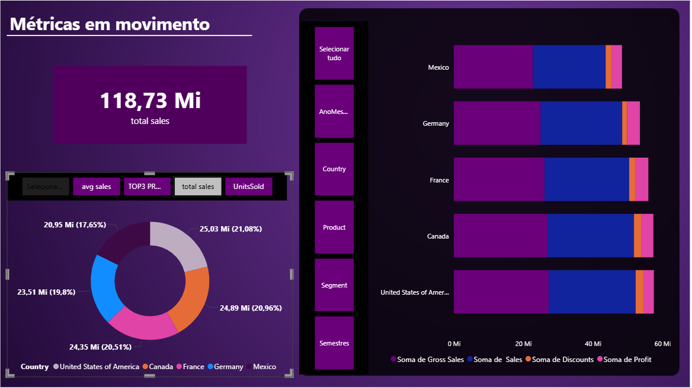

# 📊 Painel Dinâmico de Métricas — Power BI

Este projeto apresenta um painel interativo desenvolvido no Power BI, com foco em análise de métricas financeiras como **Profit**, **Sales**, **Discounts**, **Manufacturing Price** e **Gross Sales**. A navegação é feita por meio de **parâmetro de campo**, permitindo ao usuário alternar entre diferentes indicadores com um único slicer.

## 🧩 Funcionalidade implementada

### ✅ Cartão Dinâmico de Métrica Selecionada

- Exibe o **valor total** da métrica escolhida pelo usuário.
- Utiliza **parâmetro de campo** para alternar entre colunas numéricas.

## 📌 Como funciona

1. O usuário seleciona uma métrica no slicer (ex: Profit, Sales).
2. O cartão exibe automaticamente o valor total da métrica escolhida.
3. O visual respeita os filtros aplicados (Ano/Mês, País, Segmento, Produto, Semestre).

## 🛠️ Recursos utilizados

- Parâmetro de campo (`SelecionarMetrica`)
- Visual de cartão (Card)
- Filtros contextuais
- Interface responsiva e intuitiva

## 📁 Estrutura do projeto

📂 PowerBI-Metricas ├── Painel.pbix └── README.md

## 🚀 Próximos passos

- Adicionar gráficos comparativos por produto e país
- Incluir visualizações percentuais (pie chart)
- Criar cartões complementares com DAX para insights estratégicos

---

Feito por: Victor Biscaia
linkedin: https://www.linkedin.com/in/victor-biscaia-097603371/

